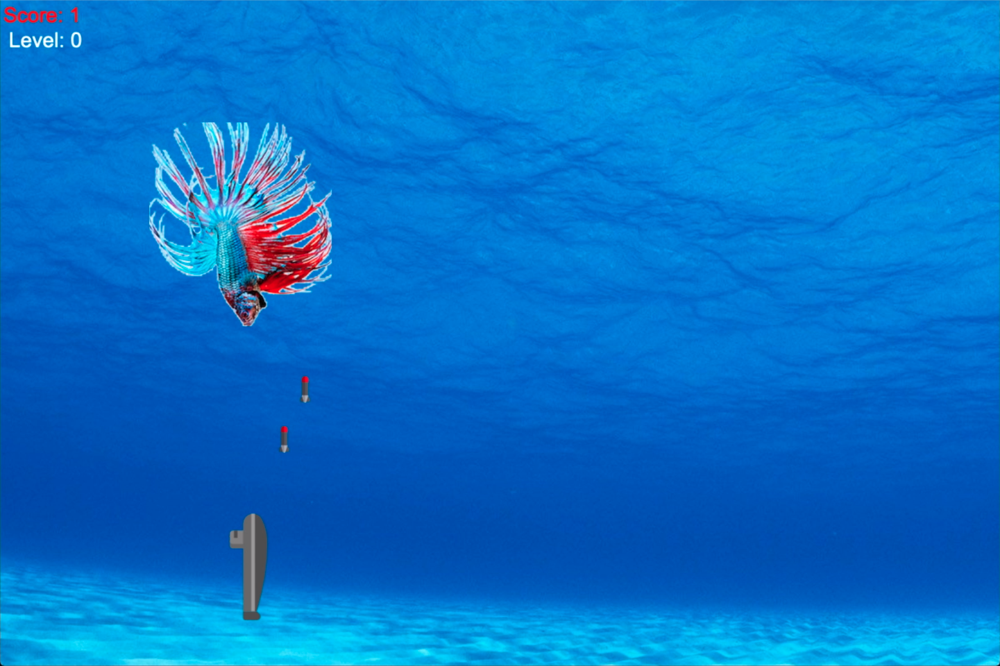

# Submarine
Besides Tic Tac Toe, Submarine was also one of my very first games I have ever developed.

    
    

 
As part of my studies in the fourth semester at the Beuth University of Applied Sciences, a classmate and I developed Submarine with the framework Qt in C/C++.
  
The gameplay is very simple - like in the game <strong>Space Invaders</strong>, enemies are floating down from the top trying to hit the player. The player has to shoot the enemies to achieve points.. so yes, very simple. We used royalty-free vector images (for the enemies, the submarine and torpedo) and also implemented royalty-free sound effects like the sonar pulse submarines make under water or a shooting sound when the player fires a torpedo.
  
I WAS TASKED WITH SEVERAL RESPONSIBILITIES - INCLUDING: 
- PROGRAMMING ENEMIES AND PLAYER MOVEMENT 
- SOUND EFFECTS IMPLEMENTATION
