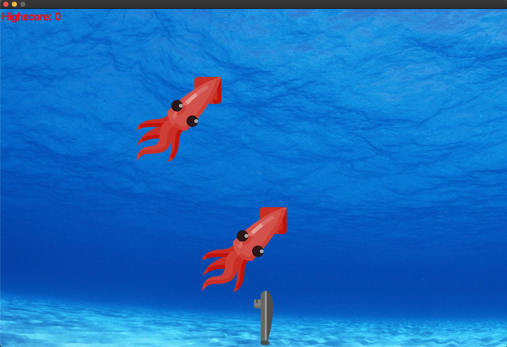
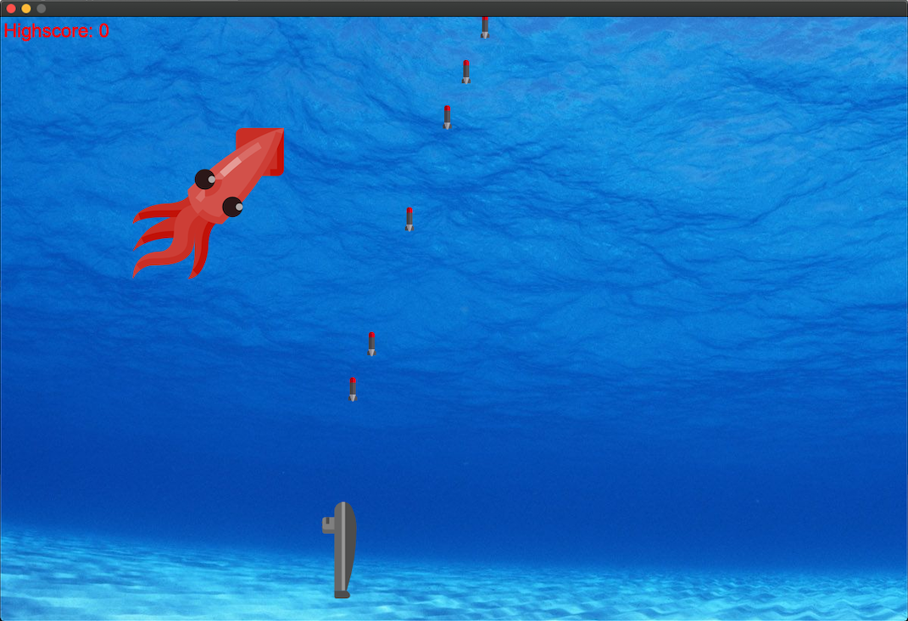

# Submarine-Game
Game I made with Qt in C++

    
    

 

In the fifth semester of my bachelor studies at the Beuth University of Applied Sciences I developed this game in a four-member team. We used Unity with C#. In addition to the implementation of various features, I supported the team as Scrum Master. The topic was "Little Rocket Man" and the game focusses to explore an open-world and to solve tricky puzzles.
