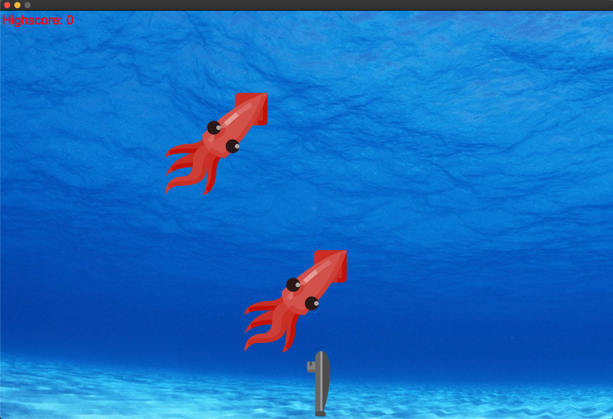
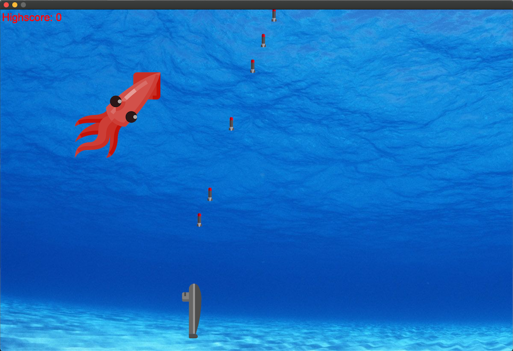

# Submarine
A game I made with Qt in C++

    
    

 

In the forth semester of my bachelor studies at the Beuth University of Applied Sciences a classmate and I developed our very first game with the framework Qt and C++ called Submarine. The gameplay is simple, like in the Space Invaders enemies are floating down from the top trying to hit the player. The Player has to shoot the enemies got archieve Hitpoints
